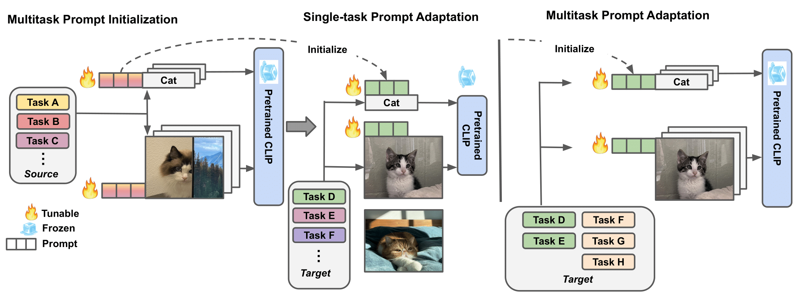
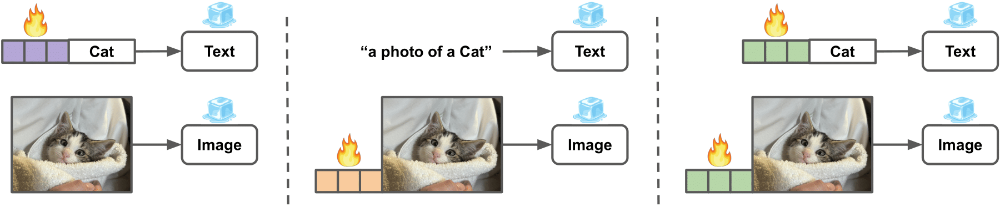
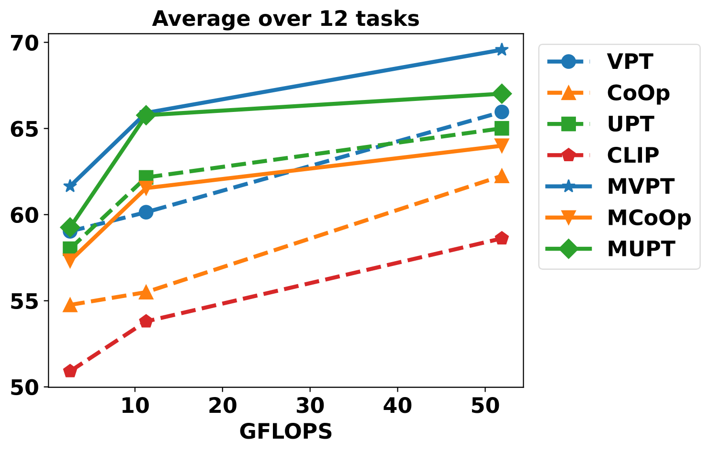

# Multitask Prompt Learning for Vision-Language Models

This repo contains the codebase of a series of research projects focused on adapting vision-language models like [CLIP](https://arxiv.org/abs/2103.00020) to downstream datasets via *multitask prompt learning*:

* [Multitask Vision-Language Prompt Tuning](https://arxiv.org/pdf/2211.11720.pdf)

<p align="center">
  
</p>

<p align="center">
  
  <figcaption align = "center"><b>&nbsp;&nbsp;&nbsp;&nbsp;&nbsp;&nbsp;&nbsp; &nbsp;&nbsp;&nbsp;&nbsp;&nbsp;&nbsp;&nbsp; &nbsp;&nbsp;&nbsp;&nbsp;&nbsp;&nbsp;&nbsp; &nbsp;&nbsp;&nbsp;&nbsp;&nbsp;&nbsp;&nbsp; &nbsp;&nbsp;&nbsp;&nbsp;&nbsp;&nbsp;&nbsp; &nbsp;&nbsp;&nbsp;&nbsp;&nbsp;&nbsp;&nbsp; (a) CoOp &nbsp;&nbsp;&nbsp;&nbsp;&nbsp;&nbsp;&nbsp; &nbsp;&nbsp;&nbsp;&nbsp;&nbsp;&nbsp;&nbsp; &nbsp;&nbsp;&nbsp;&nbsp;&nbsp;&nbsp;&nbsp; (b) VPT &nbsp;&nbsp;&nbsp;&nbsp;&nbsp;&nbsp;&nbsp; &nbsp;&nbsp;&nbsp;&nbsp;&nbsp;&nbsp;&nbsp; &nbsp;&nbsp;&nbsp;&nbsp;&nbsp;&nbsp;&nbsp; (c) UPT</b></figcaption>
</p>

## How to Install
This code is built on top of the toolbox [Dassl.pytorch](https://github.com/KaiyangZhou/Dassl.pytorch) and [CoOp](https://github.com/KaiyangZhou/CoOp) so you need to install the [`dassl`](https://github.com/KaiyangZhou/Dassl.pytorch#installation) and [PyTorch](https://pytorch.org/) environment first. After that, run `pip install -r requirements.txt` under `MVLPT/` to install a few more packages required by [CLIP](https://github.com/openai/CLIP) (this should be done when `dassl` is activated). Then, you are ready to go.

Follow [DATASETS.md](DATASETS.md) to install the datasets from [CoOp](https://github.com/KaiyangZhou/CoOp/tree/main/datasets) for multitask source prompt initialization or run the following script after install `gdown`. 
```bash
bash scripts/data.sh
```

Note that the dataset for target [ELEVATER](https://arxiv.org/pdf/2204.08790.pdf) benchmark will be downloaded automatically in `MVLPT/trainers/vision_benchmark/`. 
## How to Run

Click a paper below to see the detailed instructions on how to run the code to reproduce the results.

* [Multitask Vision-Language Prompt Tuning](MVLPT.md)

## Models and Results

- The pre-trained weights of MVLPT (MCoOp, MVPT, MUPT) on 11 tasks based on ViT-B/16 and ViT-B/32 can be downloaded altogether via this [link](https://drive.google.com/file/d/1YWVLsVcsTEP_z3ehIDgGpFTNalTG_1IE/view?usp=sharing). The weights can be used to reproduce the results in Table 1 of MVLPT's paper (i.e., the results on ImageNet and its four variants with domain shift). To load the weights and run the evaluation code, you will need to specify `--model-dir` and `--load-epoch` (see this [script](https://github.com/sIncerass/MVLPT/blob/main/scripts/mvlpt/main_single_elevater_cut.sh) for example).

<p align="center">
  
</p>


## Citation
If you use this code in your research, please kindly cite the following papers

```bash
@article{shen2022mvlpt,
    title={Multitask Vision-Language Prompt Tuning},
    author = {Shen, Sheng and Yang, Shijia and Zhang, Tianjun and Zhai, Bohan and Gonzalez, Joseph E. and Keutzer, Kurt and Darrell, Trevor},
    journal={arXiv preprint arXiv:2211.11720},
    year={2022}
}
```
